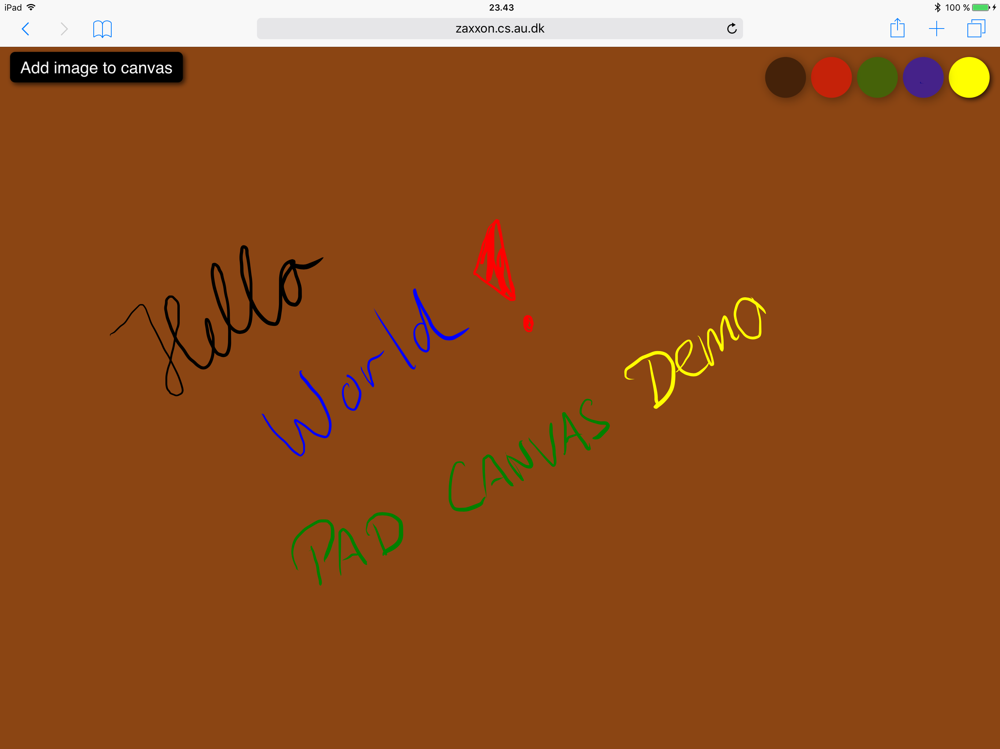
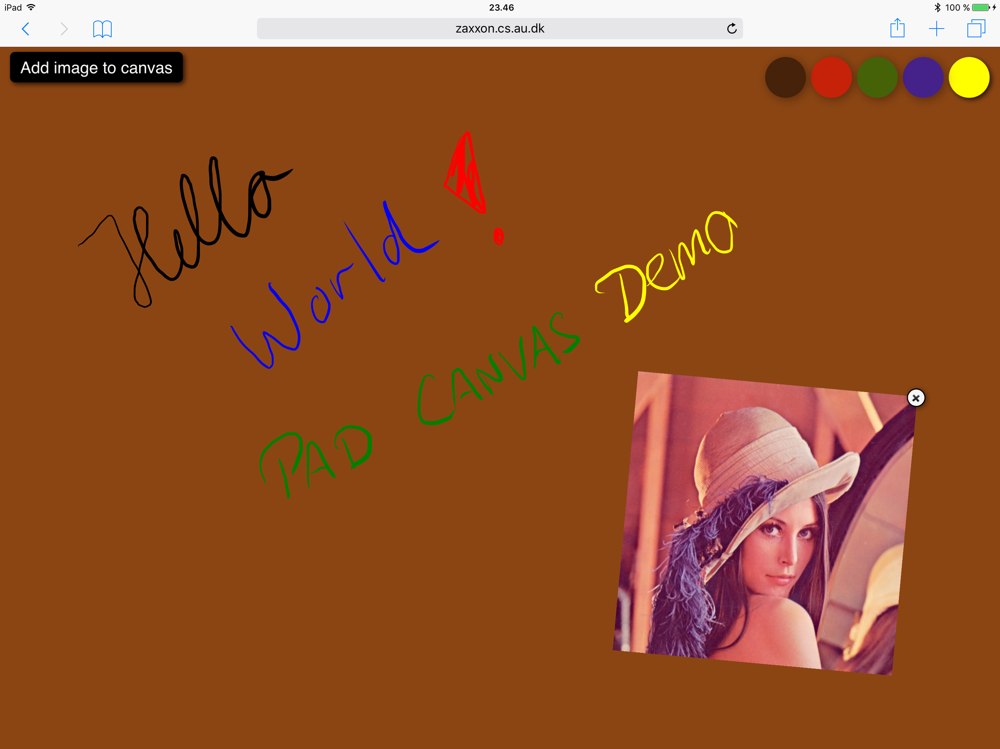
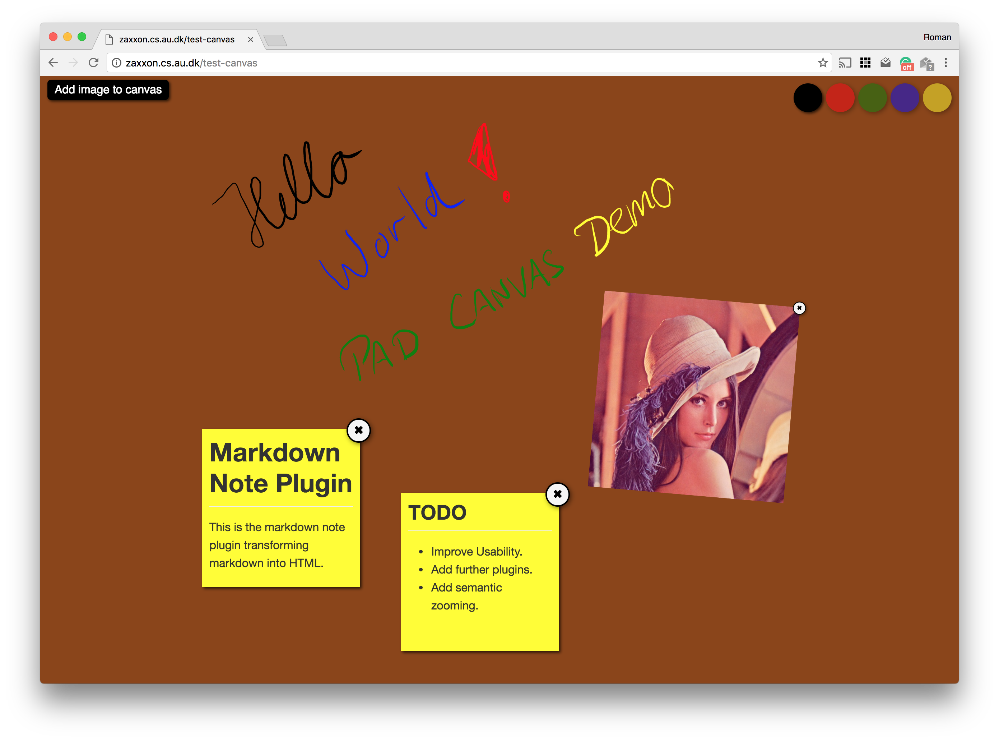
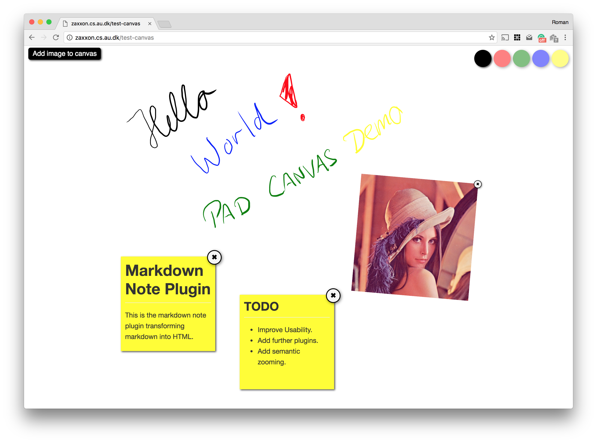

Pad Tutorial
=================

In this tutorial, we will create an infinite canvas. The canvas allows panning, rotation,
and zooming. You can draw on the canvas using an Apple Pen (other stylus devices will be
supported in future). It also allows to add images or add markdown notes to it. 

>**Attention:** This tutorial will use the concept of [external webstrates](https://github.com/Webstrates/common-libs/tree/dev).
>External webstrates can be seen as documents loaded into a document similar to external
scripts (e.g., *.js) or external stylesheets (e.g., *.css). 

# 1. Getting started

Create a new webstrate document (e.g., `/my-pad`) with the following html. This document will henceforth be
referred as `Pad Document`. The document adds the `Babel` library, which will transform scripts
into ES2015 compatible JavaScript code. Babel is required to use ES6 `class` constructs together with
WebKit devices. In this tutorial, we will use classes and therefore the Babel library is necessary.

```html
<html>
<head>
    <!-- Babel standalone, so external scripts are transformed to ES2015 compatible code -->
    <script src="https://cdnjs.cloudflare.com/ajax/libs/babel-standalone/6.18.1/babel.min.js" integrity="sha256-ytbyYjrh7reluPwZgVEBSe7b4TLcLzsUi54AxrF/dDw=" crossorigin="anonymous"></script>

    <!-- Webstrates External Script/Stylesheet Bootstrap -->
    <script type="text/javascript" src="https://rawgit.com/Webstrates/common-libs/dev/build/external-webstrates.js"></script>

    <style type="text/css">
        html,
        body {
            margin: 0;
            padding: 0;
            width: 100%;
            height: 100%;
            overflow: hidden;
        }

        #content {
            width: 100%;
            height: 100%;
            display: -webkit-flex;
            display: flex;
        }

        #content > div {
            margin: 20px;
            width: 100%;
            box-shadow:  0px 0px 15px black;
            overflow: hidden;

            /* svg does not work with border-radius. Therefore a padding of 2px to move svg 2px inwards. */
            padding: 2px;
            border-radius: 2px;

            /* DEBUG COLOR */
            background: orange;
        }

        iframe {
            width: 100%;
            height: 100%;
            min-height: 100%;            
            border: none;
            overflow: hidden;

            /* DEBUG COLOR */
            background-color: saddlebrown;
        }
    </style>
    <script type="text/javascript">
        webstrate.on("loaded", function(webstrateId) {
            const iframe = document.querySelector('#padsheet');

            // Create a padsheet on first load named <webstrate>_sheet.
            if (!iframe.src) {
                iframe.src = '/' + webstrateId + '_sheet';
            }
        });
    </script>
</head>
<body>
    <div id="content">
        <iframe id="padsheet"></iframe>
    </div>
</body>
</html>
```

Open the webstrate in a browser or reload the page if you have it already open in a browser.
Don't worry if the browser renders a page with a `saddlebrown` background. That is actually
intentional. Also, it should have generated a new webstrate `<webstrateId>_sheet` (e.g., `my-pad_sheet`)
and set it as the `iframe#padsheet` src. This padsheet will actually be our canvas on which we draw and
to which we can add notes and images. Henceforth, we use padsheet and canvas interchangeably.

# 2. Add basics

In order to make the canvas/padsheet interactive, this tutorial relies on `hammer.js` and our `transformer.js`
APIs. We further provide a `pad.js` library that augments the padsheet with additional html
markup and serves as base class to add plugins like `CanvasInteraction`. Add the following
`<wscript>` elements to the `<head>` of your document but below the Babel and external webstrates
scripts.

```html
<!-- Pad Canvas Libraries -->
<wscript type="webstrate/javascript" src="/pad.js"></wscript>
<wscript type="webstrate/javascript" src="/pad.manipulation-behavior.js"></wscript>
<wscript type="webstrate/javascript" src="/pad.plugin.canvas-interaction.js"></wscript>
<wscript type="webstrate/javascript" src="/pad.plugin.canvas-object-interaction.js"></wscript>
<wscript type="webstrate/javascript" src="/pad.plugin.canvas-drawing.js"></wscript>
<wscript type="webstrate/javascript" src="/pad.plugin.image-box.js"></wscript>
```

>**Attention:** Due to a potential bug in the external webstrates library make sure to always replace
>the entire `Pad Document` with the new document markup. Otherwise the `Pad Document` will eventually have two
>`<body>` elements and break.

## This is the complete `Pad Document` after step 2.

```html
<html>
<head>
    <!-- Babel standalone, so external scripts are transformed to ES2015 compatible code -->
    <script src="https://cdnjs.cloudflare.com/ajax/libs/babel-standalone/6.18.1/babel.min.js" integrity="sha256-ytbyYjrh7reluPwZgVEBSe7b4TLcLzsUi54AxrF/dDw=" crossorigin="anonymous"></script>

    <!-- Webstrates External Script/Stylesheet Bootstrap -->
    <script type="text/javascript" src="https://rawgit.com/Webstrates/common-libs/dev/build/external-webstrates.js"></script>

    <wscript type="webstrate/javascript" src="/transformer-stable.js"></wscript>
    <wscript type="webstrate/javascript" src="/hammer.min.js"></wscript>
    <wscript type="webstrate/javascript" src="/hammer-time.min.js"></wscript>

    <!-- Pad Canvas Libraries -->
    <wscript type="webstrate/javascript" src="/pad.js"></wscript>
    <wscript type="webstrate/javascript" src="/pad.manipulation-behavior.js"></wscript>
    <wscript type="webstrate/javascript" src="/pad.plugin.canvas-interaction.js"></wscript>
    <wscript type="webstrate/javascript" src="/pad.plugin.canvas-object-interaction.js"></wscript>
    <wscript type="webstrate/javascript" src="/pad.plugin.canvas-drawing.js"></wscript>
    <wscript type="webstrate/javascript" src="/pad.plugin.image-box.js"></wscript>

    <style type="text/css">
        html,
        body {
            margin: 0;
            padding: 0;
            width: 100%;
            height: 100%;
            overflow: hidden;
        }

        #content {
            width: 100%;
            height: 100%;
            display: -webkit-flex;
            display: flex;
        }

        #content > div {
            margin: 20px;
            width: 100%;
            box-shadow:  0px 0px 15px black;
            overflow: hidden;

            /* svg does not work with border-radius. Therefore a padding of 2px to move svg 2px inwards. */
            padding: 2px;
            border-radius: 2px;

            /* DEBUG COLOR */
            background: orange;
        }

        iframe {
            width: 100%;
            height: 100%;
            min-height: 100%;            
            border: none;
            overflow: hidden;

            /* DEBUG COLOR */
            background-color: saddlebrown;
        }
    </style>
    <script type="text/javascript">
        webstrate.on("loaded", function(webstrateId) {
            const iframe = document.querySelector('#padsheet');

            // Create a padsheet on first load named <webstrate>_sheet.
            if (!iframe.src) {
                iframe.src = '/' + webstrateId + '_sheet';
            }
        });
    </script>
</head>
<body>
    <div id="content">
        <iframe id="padsheet"></iframe>
    </div>
</body>
</html>
```

Reload the browser! The browser console should now print the following messages.


# 3. Configure the Pad

Now that we loaded all the external libraries, we need to configure our pad. Therefore,
create a new webstrate document (e.g., `/my-pad-configuration.js`) with the following html as content.
This document defines the pad and all plugins added to the pad. We will later create a `MarkdownNote` plugin
and add it also as a new plugin to the pad configuration.

```html
<html>
<body>
<pre id="webstrate">'use strict';

const pad = new Pad.Manager();
pad.addPlugin(new Pad.Plugins.CanvasObjectInteraction());
pad.addPlugin(new Pad.Plugins.CanvasInteraction());
pad.addPlugin(new Pad.Plugins.CanvasDrawing());
pad.addPlugin(new Pad.Plugins.ImageBox());
</pre>
</body>
</html>
```

Then edit the pad document and add a `<wscript>` to the `<head>` to load your pad configuration as
an external webstrate. Replace `YOUR_PAD_CONFIGURATION_DOCUMENT_NAME` with the webstrate id of the
document you just created in the previous step (e.g., `/my-pad-configuration.js`).

```html
<wscript type="webstrate/javascript" src="/YOUR_PAD_CONFIGURATION_DOCUMENT_NAME"></wscript>
```

## This is the complete `Pad Document` after step 3.

```html
<html>
<head>
    <!-- Babel standalone, so external scripts are transformed to ES2015 compatible code -->
    <script src="https://cdnjs.cloudflare.com/ajax/libs/babel-standalone/6.18.1/babel.min.js" integrity="sha256-ytbyYjrh7reluPwZgVEBSe7b4TLcLzsUi54AxrF/dDw=" crossorigin="anonymous"></script>

    <!-- Webstrates External Script/Stylesheet Bootstrap -->
    <script type="text/javascript" src="https://rawgit.com/Webstrates/common-libs/dev/build/external-webstrates.js"></script>

    <wscript type="webstrate/javascript" src="/transformer-stable.js"></wscript>
    <wscript type="webstrate/javascript" src="/hammer.min.js"></wscript>
    <wscript type="webstrate/javascript" src="/hammer-time.min.js"></wscript>

    <!-- Pad Canvas Libraries -->
    <wscript type="webstrate/javascript" src="/pad.js"></wscript>
    <wscript type="webstrate/javascript" src="/pad.manipulation-behavior.js"></wscript>
    <wscript type="webstrate/javascript" src="/pad.plugin.canvas-interaction.js"></wscript>
    <wscript type="webstrate/javascript" src="/pad.plugin.canvas-object-interaction.js"></wscript>
    <wscript type="webstrate/javascript" src="/pad.plugin.canvas-drawing.js"></wscript>
    <wscript type="webstrate/javascript" src="/pad.plugin.image-box.js"></wscript>

    <!-- Pad Configuration -->
    <wscript type="webstrate/javascript" src="/YOUR_PAD_CONFIGURATION_DOCUMENT_NAME"></wscript>

    <style type="text/css">
        html,
        body {
            margin: 0;
            padding: 0;
            width: 100%;
            height: 100%;
            overflow: hidden;
        }

        #content {
            width: 100%;
            height: 100%;
            display: -webkit-flex;
            display: flex;
        }

        #content&gt;div {
            margin: 20px;
            width: 100%;
            box-shadow:  0px 0px 15px black;
            overflow: hidden;

            /* svg does not work with border-radius. Therefore a padding of 2px to move svg 2px inwards. */
            padding: 2px;
            border-radius: 2px;

            /* DEBUG COLOR */
            background: orange;
        }

        iframe {
            width: 100%;
            height: 100%;
            min-height: 100%;            
            border: none;
            overflow: hidden;

            /* DEBUG COLOR */
            background-color: saddlebrown;
        }
    </style>
    <script type="text/javascript">
        webstrate.on("loaded", function(webstrateId) {
            const iframe = document.querySelector('#padsheet');

            // Create a padsheet on first load named <webstrate>_sheet.
            if (!iframe.src) {
                iframe.src = '/' + webstrateId + '_sheet';
            }
        });
    </script>
</head>
<body>
    <div id="content">
        <iframe id="padsheet"></iframe>
    </div>
</body>
</html>
```

Reload the browser! The pad now has an add image button and a color picker. Try to draw on
the canvas using an Apple iPad Pro and the Apple Pen. 



Alternatively, add an image using the `Add image to canvas` button top left.

>**Attention:** After adding the image, you might need to zoom and pan a bit as the image
>will be added at `(0,0)` location of the canvas, which can be out of the current viewport.



The `CanvasInteraction` and `CanvasObjectInteraction` plugins add panning, rotation, and zooming
capabilities to the canvas and all objects added to the canvas.

Interaction on a tablet:

* Panning: Drag canvas/object to pan
* Rotation: Rotate two fingers to rotate a canvas/object.
* Zooming: Pinch canvas/object to zoom.

Interaction on a computer:

* Panning: Click and drag canvas/object to pan
* Rotation: `Alt+` (on Windows) and `Option+` (on Mac OS) mousewheel to rotate a canvas/object.
* Zooming: `Ctrl+` mousewheel to zoom canvas/object to zoom.

# 4. Create a MarkdownNote plugin

In this step, we create a markdown note plugin. The plugin will allow to add notes to the canvas
and add markdown to notes, which will be transformed into html on focus lost.

Create a new document with the following html (e.g., `/my-markdown-note-plugin.js`). The new
plugin extends from the Pad plugin class. The Pad will call `onLoad` and `onUnload` when a
plugin was loaded or respectively unloaded by the Pad. It also gives access to the Pad Manager
instance through `this.manager`, which provides access to the padsheet `this.manager.sheetCanvas`
the padsheet document `this.manager.sheetDocument` and padsheet window `this.manager.sheetWindow`.

```html
<html>
<body>
<pre id="webstrate">/**
 * The MarkdownNote plugin adds a functionality to the Pad and allows
 * adding notes to the canvas. A doubletap on the canvas will create a
 * new note at the tap location. Another doubletap on the note will switch
 * the note to a markdown editor view. The note can be edited in this view.
 * The markdown will be transformed into html markup when the focus of the note
 * is lost.
 * 
 * @class MarkdownNote
 * @extends {Pad.Plugin}
 */
class MarkdownNote extends Pad.Plugin {

    /**
     * Creates an instance of MarkdownNote.
     * 
     * @memberOf MarkdownNote
     */
    constructor() {
        // Do not forget to call super(), otherwise the plugin will not work.
        super();
    }

    /**
     * Called on plugin load. The pad manager instance is accessible through
     * this.manager. The manager instance provides access to the sheet canvas,
     * the sheet's document and window.
     * 
     * @memberOf MarkdownNote
     */
    onLoad() {

        // Get the padsheet canvas (HTMLDivElement).
        const canvas = this.manager.sheetCanvas;

        // Get the padsheet document (HTMLDocument)
        const documentBody = this.manager.sheetDocument.body;

        // Make all markdown note elements already existing on the
        // canvas interactive. This for example is the case on a browser
        // reload.
        const children = canvas.children;
        const elements = Array.from(children);
        elements.forEach(element =&gt; {
            if (element.classList.contains('markdown-note')) {
                this.makeMarkdownNoteInteractive(element);
            }
        });

        // This callback will be called whenever a new markdown note was
        // added (locally or remote) to the canvas. Make each note that was
        // added to the canvas interactive.
        canvas.webstrate.on("nodeAdded", (element, local) =&gt; {
            if (element.classList.contains('markdown-note')) {
                this.makeMarkdownNoteInteractive(element);
            }
        });

        // Create a HammerManager (hammer.js) to listen to doubletap events on
        // the document body. The doubletap events will later be used to add new
        // markdown notes whenever the user doubletaps on the canvas.
        this.hammerManager = new Hammer.Manager(documentBody);
        this.hammerManager.add(new Hammer.Tap({ event: 'doubletap', taps: 2 }));

        // Add callback function whenever a doubletap event happens on the document
        // body.
        this.hammerManager.on("doubletap", event =&gt; {

            // When the event target is a markdown note or any of its children, then
            // switch to markdown note edit mode.
            if (event.target.closest('.markdown-note')) {
                const element = event.target.closest('.markdown-note');
                this.switchEditMode(element, true);
                return;
            }

            // Ignore if event target is not document body or the canvas element. Only
            // create new markdown notes when doubletap occured on the canvas or the
            // document body.
            if (event.target !== documentBody &amp;&amp; event.target !== canvas) {
                return;
            }

            // The next part will work with the canvas transform to add the markdown note
            // at the doubletap x/y position, to rotate it so the note is always in a '0'
            // angle to the current viewport, and the note has always the same size and
            // dependent on the current zoom factor.
            const canvasTransforms = canvas.transforms;

            // Convert the global doubletap point to the canvas local coordinates.
            let point = new Transformer.Point(event.center.x, event.center.y);
            point = canvasTransforms.fromGlobalToLocal(point)

            const x = point.x;
            const y = point.y;

            // Adjust rotation of the note.
            const angle = -canvasTransforms.rotateTransform.angle % 360;

            // Adjust scaling of the note.
            const scaleX = 1 / canvasTransforms.scaleTransform.x;
            const scaleY = 1 / canvasTransforms.scaleTransform.y;

            // Create a new note. This function will also add the note to the canvas.
            const note = this.createMarkdownNote();

            // Bind our Transformer API to the note element. The Transformer API allows
            // setting translation, rotation, and scaling independent of the current transform
            // of the canvas.
            // ATTENTION: The `debug` flag adds the origin point X/Y and the transform origin indicator
            // to the note element. Remove this in production!
            Transformer.bindElement(note, null, /*debug*/ true)
                .then(transformer =&gt; {

                    // Finally set previously determined translate, rotate, and scale factors.
                    transformer.transformOrigin.set(0.5, 0.5);
                    transformer.translateTransform.set(x, y);
                    transformer.rotateTransform.set(angle);
                    transformer.scaleTransform.set(scaleX, scaleY);

                    // Wait for the next animation frame to reapply the new transforms.
                    window.requestAnimationFrame(() =&gt; {
                        transformer.reapplyTransforms();
                    });
                });
        });
    }

    /**
     * Called on plugin unload. The pad manager instance is accessible through
     * this.manager.
     * 
     * @memberOf MarkdownNote
     */
    onUnload() {

        // Destroy HammerManager if exists.
        if (this.hammerManager) {
            this.hammerManager.destroy();
        }
    }

    /**
     * Make the markdown note interactive. Add a transient element, which will contain
     * the transformed markdown into html. It is important to notice that only the markdown
     * is synchronized by webstrate. The transformed html is added to a transient element
     * and only available locally.
     * 
     * @param {any} element The html element with the .markdown-note class.
     * 
     * @memberOf MarkdownNote
     */
    makeMarkdownNoteInteractive(element) {

        // Create transient element to add transient functionality. Thereby only relevant
        // data is synchronized by Webstrates.
        const transient = document.createElement("transient");

        // Get element containing the actual markdown.
        const input = element.querySelector('.markdown-input');

        // Make the markdown input element editable (if not already).
        input.setAttribute("contenteditable", true);

        // Switch markdown note from edit mode to non-edit mode on blur.
        input.addEventListener("blur", event =&gt; {
            this.switchEditMode(element, false);
        });

        // Add a transient div holding the marked html content. Also transform the initial
        // markdown to html and set it as new innerHTML. Then append the element containing
        // the marked html to the transient element. 
        const html = document.createElement("div");
        html.setAttribute("class", "marked-html");
        html.innerHTML = marked(input.innerText);
        transient.appendChild(html);
        element.appendChild(transient);

        // WORKAROUND: In order to listen to changes in the markup, reapply them, and replace
        // the content of the element holding the html, we use the attributeChanged event on the
        // actual markdown note element. The editmode attribute will be triggered every time a user
        // switches the note's editmode, which will be synchronized by Webstrates.
        element.webstrate.on("attributeChanged", function(attributeName, oldValue, newValue, local) {
            if (attributeName === "editmode") {
                html.innerHTML = marked(input.innerText);
            }
        });

    }

    /**
     * Switch the editmode of a note.
     * 
     * @param {any} element The actual markdown note element.
     * @param {any} editable True if editable, false otherwise.
     * 
     * @memberOf MarkdownNote
     */
    switchEditMode(element, editable) {
        element.setAttribute("editmode", `${editable}`);
        if (editable) {
            const input = element.querySelector('.markdown-input');
            input.focus();
        }
    }

    /**
     * Create a new markdown note. The function also appends the new note to the canvas element and
     * sets all required css class on the element.
     * 
     * @returns The new markdown note element.
     * 
     * @memberOf MarkdownNote
     */
    createMarkdownNote() {
        const note = document.createElement("div");
        note.setAttribute("class", "markdown-note");
        note.setAttribute("editmode", "false");

        const markdownInput = document.createElement("div");
        markdownInput.setAttribute("class", "markdown-input");
        note.appendChild(markdownInput);

        this.manager.sheetCanvas.appendChild(note);

        return note;
    }
}

// Finally register the MarkdownNote pad plugin. This step is not necessary if the MarkdownNote
// class is accessible in global scope. We will use the MarkdownNote class in a next step and add
// this new functionality to the Pad.
Pad.registerPlugin(MarkdownNote, "MarkdownNote");</pre>
</body>
</html>
```

Load the new plugin by adding a `<wscript>` to the `Pad Document`. Replace `MY_MARKDOWN_NOTE_PLUGIN_DOCUMENT`
with the id of your just created webstrate document. Also make sure to add the [marked](https://github.com/chjj/marked)
library as dependency.

```html
<wscript type="webstrate/javascript" src="/marked.min.js"></wscript>
<wscript type="webstrate/javascript" src="/MY_MARKDOWN_NOTE_PLUGIN_DOCUMENT"></wscript>
```

## This is the complete `Pad Document` after step 4.

```html
<html>
<head>
    <!-- Babel standalone, so external scripts are transformed to ES2015 compatible code -->
    <script src="https://cdnjs.cloudflare.com/ajax/libs/babel-standalone/6.18.1/babel.min.js" integrity="sha256-ytbyYjrh7reluPwZgVEBSe7b4TLcLzsUi54AxrF/dDw=" crossorigin="anonymous"></script>

    <!-- Webstrates External Script/Stylesheet Bootstrap -->
    <script type="text/javascript" src="https://rawgit.com/Webstrates/common-libs/dev/build/external-webstrates.js"></script>

    <wscript type="webstrate/javascript" src="/transformer-stable.js"></wscript>
    <wscript type="webstrate/javascript" src="/hammer.min.js"></wscript>
    <wscript type="webstrate/javascript" src="/hammer-time.min.js"></wscript>

    <!-- Pad Canvas Libraries -->
    <wscript type="webstrate/javascript" src="/pad.js"></wscript>
    <wscript type="webstrate/javascript" src="/pad.manipulation-behavior.js"></wscript>
    <wscript type="webstrate/javascript" src="/pad.plugin.canvas-interaction.js"></wscript>
    <wscript type="webstrate/javascript" src="/pad.plugin.canvas-object-interaction.js"></wscript>
    <wscript type="webstrate/javascript" src="/pad.plugin.canvas-drawing.js"></wscript>
    <wscript type="webstrate/javascript" src="/pad.plugin.image-box.js"></wscript>

    <!-- Your Pad MarkdownNote Plugin -->
    <wscript type="webstrate/javascript" src="/marked.min.js"></wscript>
    <wscript type="webstrate/javascript" src="/MY_MARKDOWN_NOTE_PLUGIN_DOCUMENT"></wscript>

    <!-- Pad Configuration -->
    <wscript type="webstrate/javascript" src="/YOUR_PAD_CONFIGURATION_DOCUMENT_NAME"></wscript>

    <style type="text/css">
        html,
        body {
            margin: 0;
            padding: 0;
            width: 100%;
            height: 100%;
            overflow: hidden;
        }

        #content {
            width: 100%;
            height: 100%;
            display: -webkit-flex;
            display: flex;
        }

        #content&gt;div {
            margin: 20px;
            width: 100%;
            box-shadow:  0px 0px 15px black;
            overflow: hidden;

            /* svg does not work with border-radius. Therefore a padding of 2px to move svg 2px inwards. */
            padding: 2px;
            border-radius: 2px;

            /* DEBUG COLOR */
            background: orange;
        }

        iframe {
            width: 100%;
            height: 100%;
            min-height: 100%;            
            border: none;
            overflow: hidden;

            /* DEBUG COLOR */
            background-color: saddlebrown;
        }
    </style>
    <script type="text/javascript">
        webstrate.on("loaded", function(webstrateId) {
            const iframe = document.querySelector('#padsheet');

            // Create a padsheet on first load named <webstrate>_sheet.
            if (!iframe.src) {
                iframe.src = '/' + webstrateId + '_sheet';
            }
        });
    </script>
</head>
<body>
    <div id="content">
        <iframe id="padsheet"></iframe>
    </div>
</body>
</html>
```

Adjust the pad configuration by adding the new `MarkdownNote` plugin.

```html
<html>
<body>
<pre id="webstrate">'use strict';

const pad = new Pad.Manager();
pad.addPlugin(new Pad.Plugins.CanvasObjectInteraction());
pad.addPlugin(new Pad.Plugins.CanvasInteraction());
pad.addPlugin(new Pad.Plugins.CanvasDrawing());
pad.addPlugin(new Pad.Plugins.ImageBox());

// Add MarkdownNote Plugin. It will be accessible through Pad.Plugins since we register the
// plugin in the previous step.
pad.addPlugin(new Pad.Plugins.MarkdownNote());
</pre>
</body>
</html>
```

Reload the browser! A doubletap on the canvas creates a new markdown note. Doubletap a note (again)
puts it in edit mode. Add some markdown and focus on another element (so it looses focus) to transform
the markdown in html and switch from editmode in non-editmode.



>**Attention:** Sometimes, on an iOS devices the focus is not lost and therefore the markdown is not transformed
>into html.

# 5. Change styling

Go to Pad webstrate and remove DEBUG styling such as the `saddlebrown` background.

>Document after step 5.
```html
<html>
<head>
    <!-- Babel standalone, so external scripts are transformed to ES2015 compatible code -->
    <script src="https://cdnjs.cloudflare.com/ajax/libs/babel-standalone/6.18.1/babel.min.js" integrity="sha256-ytbyYjrh7reluPwZgVEBSe7b4TLcLzsUi54AxrF/dDw=" crossorigin="anonymous"></script>

    <!-- Webstrates External Script/Stylesheet Bootstrap -->
    <script type="text/javascript" src="https://rawgit.com/Webstrates/common-libs/dev/build/external-webstrates.js"></script>

    <wscript type="webstrate/javascript" src="/transformer-stable.js"></wscript>
    <wscript type="webstrate/javascript" src="/hammer.min.js"></wscript>
    <wscript type="webstrate/javascript" src="/hammer-time.min.js"></wscript>

    <!-- Pad Canvas Libraries -->
    <wscript type="webstrate/javascript" src="/pad.js"></wscript>
    <wscript type="webstrate/javascript" src="/pad.manipulation-behavior.js"></wscript>
    <wscript type="webstrate/javascript" src="/pad.plugin.canvas-interaction.js"></wscript>
    <wscript type="webstrate/javascript" src="/pad.plugin.canvas-object-interaction.js"></wscript>
    <wscript type="webstrate/javascript" src="/pad.plugin.canvas-drawing.js"></wscript>
    <wscript type="webstrate/javascript" src="/pad.plugin.image-box.js"></wscript>

    <!-- Your Pad MarkdownNote Plugin -->
    <wscript type="webstrate/javascript" src="/marked.min.js"></wscript>
    <wscript type="webstrate/javascript" src="/MY_MARKDOWN_NOTE_PLUGIN_DOCUMENT"></wscript>

    <!-- Pad Configuration -->
    <wscript type="webstrate/javascript" src="/YOUR_PAD_CONFIGURATION_DOCUMENT_NAME"></wscript>

    <style type="text/css">
        html,
        body {
            margin: 0;
            padding: 0;
            width: 100%;
            height: 100%;
            overflow: hidden;
        }

        #content {
            width: 100%;
            height: 100%;
            display: -webkit-flex;
            display: flex;
        }

        #content > div {
            margin: 20px;
            width: 100%;
            box-shadow:  0px 0px 15px black;
            overflow: hidden;

            /* svg does not work with border-radius. Therefore a padding of 2px to move svg 2px inwards. */
            padding: 2px;
            border-radius: 2px;
        }

        iframe {
            width: 100%;
            height: 100%;
            min-height: 100%;            
            border: none;
            overflow: hidden;
        }
    </style>
    <script type="text/javascript">
        webstrate.on("loaded", function(webstrateId) {
            const iframe = document.querySelector('#padsheet');

            // Create a padsheet on first load named <webstrate>_sheet.
            if (!iframe.src) {
                iframe.src = '/' + webstrateId + '_sheet';
            }
        });
    </script>
</head>
<body>
    <div id="content">
        <iframe id="padsheet"></iframe>
    </div>
</body>
</html>
```



__That's it!__

# Contribute

Please report any [issues](https://github.com/Webstrates/tutorials/issues) with this tutorial.