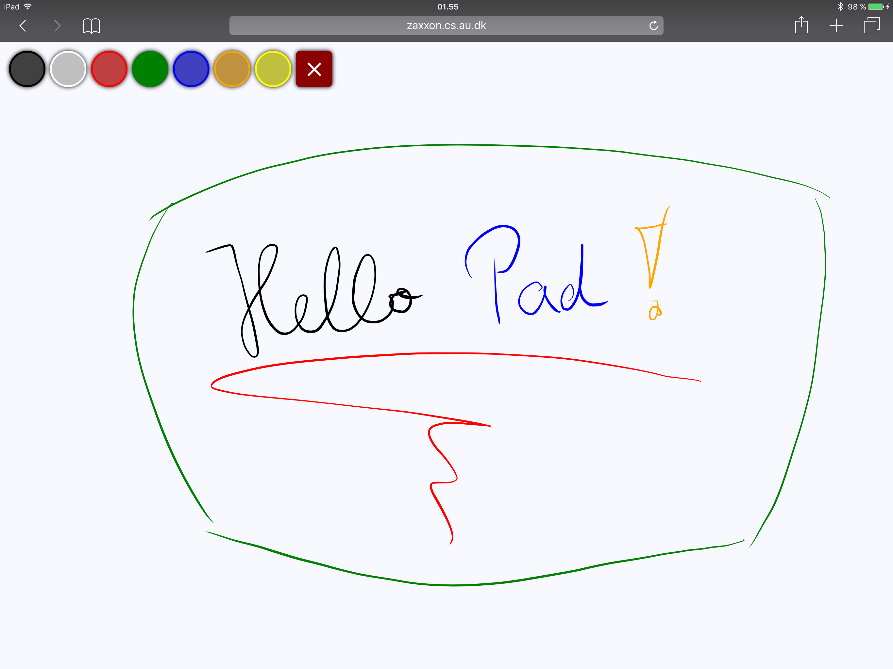
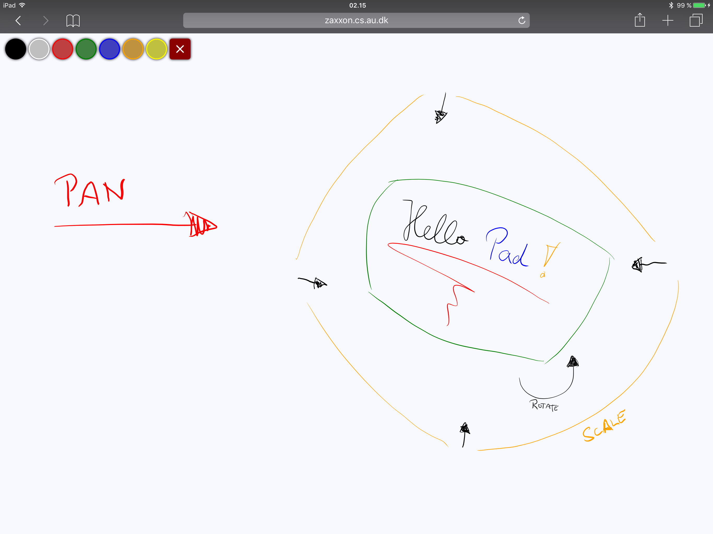
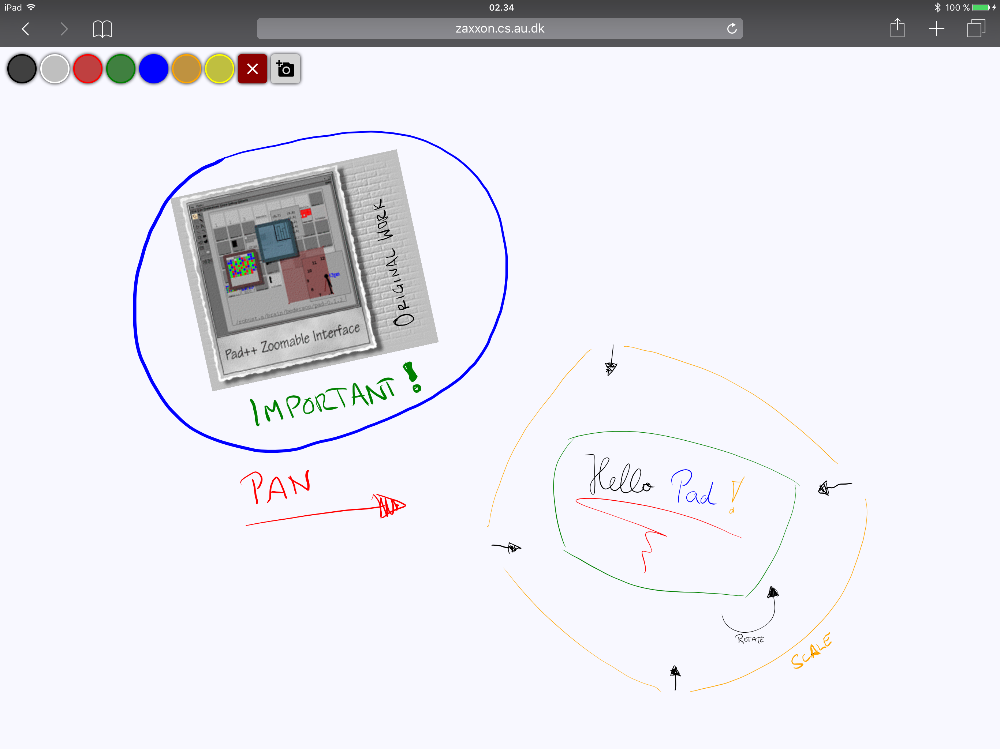

Pad Tutorial
=================

In this tutorial, we will create an infinite canvas or pad. The pad allows panning, rotation,
and zooming. You can draw on the pad using an Apple Pen (other stylus devices will be supported
in future). We will further add a tool to add pictures. 

# 1. Getting started

Create a new webstrate document (e.g., `/pad.html`) with the following html. The document adds
the `Babel` library, which will transform ES6 scripts into ES2015 compatible JavaScript code.
Babel is required to use ES6 together with WebKit devices.

```html
<html>
<head>

    <meta name="viewport" content="width=device-width, initial-scale=1.0, maximum-scale=1.0, user-scalable=no" />

    <style type="text/css">
        html,
        body {
            margin: 0;
            padding: 0;
        }
        
        body {
            width: 100vw;
            height: 100vh;
            background: deepskyblue;
        }
        
        #canvas {
            width: 100%;
            height: 100%;
            box-shadow: none;
            overflow: visible;
        }
        
        #canvas>svg {
            overflow: visible;
        }
        
        svg.drawing-canvas {
            position: absolute;
            width: 100%;
            height: 100%;
            z-index: 1;
            pointer-events: none;
        }
        
        #canvas>svg.drawing-canvas {
            width: 1px;
            height: 1px;
            overflow: visible;
        }
    </style>
</head>
<body>
    <div id="canvas"></div>
</body>
</html>
```

Open the webstrate in a browser or reload the page if you have it already open in a browser.
Don't worry if the browser renders a page with a `deepskyblue` background. That is actually
intentional for debugging to see if the webstrate is updated properly.

# 2. Add tool palette for instruments

```html
<!-- Create Transient Tool Palette -> instrument scripts will add tools to this tool palette -->
<script type="text/javascript">
    webstrate.on("loaded", function() {
        var toolPalette = document.createElement("transient");
        toolPalette.setAttribute("id", "tool-palette");
        document.body.appendChild(toolPalette);
    });
</script>

<!-- Add instrument scripts here -->
```

Also, the tool-palette requires some CSS styling.

```css
#tool-palette {
    position: fixed;
    top: 10px;
    left: 10px;
    z-index: 9999;
    transition: opacity 250ms;
}

#tool-palette>div {
    float: left;
}

#tool-palette .instrument-tool {
    position: relative;
    box-sizing: border-box;
    width: 40px;
    height: 40px;
    border: 2px solid transparent;
    border-radius: 5px;
    margin-right: 5px;
    font-size: 1.6em;
    box-shadow: 0px 0px 5px rgba(0, 0, 0, 1);
}
```

# 3. Add drawing instrument

In order to be able to draw on the pad, we add a drawing instrument with the following JavaScript.
Add this script to the `head` right after `<!-- Add instrument scripts here -->`.

```html
<!-- Drawing Instrument -->
<script type="text/javascript" id="drawing-instrument">
    webstrate.on("loaded", function() {;
        (function() {

            let svg;
            let penColor = "black";

            /**
             * Calculates the mid-point between the two points A and B and then returns
             * the mid-point.
             * 
             * @param {any} pointA The point A.
             * @param {any} pointB The point B.
             * @returns The mid-point between point A and point B.
             */
            const midPointBetween = (pointA, pointB) => {
                return {
                    x: pointA.x + (pointB.x - pointA.x) / 2,
                    y: pointA.y + (pointB.y - pointA.y) / 2
                };
            }

            /**
             * Generates a path with regard to thickness of each point in path. This
             * implementation was done by @clemens.
             * 
             * @param {any} points Path points with x- and y-position and a thickness per
             * point.
             * @returns The path as string.
             */
            const generatePath = (points) => {

                const newPoints = [];
                newPoints.push(points[0]);

                for (let j = 1; j < points.length - 1; j++) {
                    let p1 = points[j - 1];
                    let p = points[j];
                    let p2 = points[j + 1];
                    let c = {
                        x: p2.x - p1.x,
                        y: p2.y - p1.y
                    };
                    let n = {
                        x: -c.y,
                        y: c.x
                    };
                    let len = Math.sqrt(n.x * n.x + n.y * n.y);
                    if (len == 0) continue;
                    let u = {
                        x: n.x / len,
                        y: n.y / len
                    };

                    newPoints.push({
                        x: p.x + u.x * p.thickness,
                        y: p.y + u.y * p.thickness
                    });
                }
                newPoints.push(points[points.length - 1]);

                for (let j = points.length - 2; j > 0; j--) {
                    let p1 = points[j + 1];
                    let p = points[j];
                    let p2 = points[j - 1];
                    let c = {
                        x: p2.x - p1.x,
                        y: p2.y - p1.y
                    };
                    let n = {
                        x: -c.y,
                        y: c.x
                    };
                    let len = Math.sqrt(n.x * n.x + n.y * n.y);
                    if (len == 0) continue;
                    let u = {
                        x: n.x / len,
                        y: n.y / len
                    };

                    newPoints.push({
                        x: p.x + u.x * p.thickness,
                        y: p.y + u.y * p.thickness
                    });
                }
                let p1 = newPoints[0];
                let p2 = newPoints[1];
                let pathString = "M" + p1.x + " " + p1.y;
                for (let j = 1; j < newPoints.length; j++) {
                    let midPoint = midPointBetween(p1, p2);
                    if (isNaN(p1.x) || isNaN(p1.y) || isNaN(midPoint.x) || isNaN(midPoint.y)) {
                        console.log("NaN");
                    }
                    pathString = pathString += " Q " + p1.x + " " + p1.y + " " + midPoint.x + " " + midPoint.y;
                    p1 = newPoints[j];
                    p2 = newPoints[j + 1];
                }

                return pathString;
            }

            const onPenDown = (pen, points, path) => {
                const { x, y, thickness } = pen;

                const point = { x, y, thickness };
                points.push(point);

                path.setAttribute("d", generatePath(points));
                path.setAttribute("fill", pen.color);

                svg.appendChild(path);
            }

            const onPenMove = (pen, points, path) => {
                const { x, y, thickness } = pen;

                const point = { x, y, thickness };
                points.push(point);

                path.setAttribute("d", generatePath(points));
            }

            const createToolPalette = () => {

                const toolPalette = document.querySelector('#tool-palette');

                const drawingTools = document.createElement("div");
                drawingTools.setAttribute("class", "drawing-instrument-tools");

                const clearCanvas = document.createElement("div");
                clearCanvas.setAttribute("class", "instrument-tool clear-drawing-canvas");
                clearCanvas.addEventListener("touchstart", event => {
                    Array.from(document.querySelectorAll("svg")).forEach(svg => {
                        svg.remove();
                    });
                });
                clearCanvas.addEventListener("click", event => {
                    Array.from(document.querySelectorAll("svg")).forEach(svg => {
                        svg.remove();
                    });
                });
                drawingTools.appendChild(clearCanvas);

                const colors = [
                    "black",
                    "white",
                    "red",
                    "green",
                    "blue",
                    "orange",
                    "yellow"
                ];

                const colorsElement = document.createElement("ul");
                colorsElement.setAttribute("class", "colors");
                drawingTools.appendChild(colorsElement);

                let activeColor;
                colors.forEach((color, index) => {
                    const colorElement = document.createElement("li");
                    colorElement.setAttribute("class", "instrument-tool color");
                    colorElement.style.background = color;
                    colorsElement.appendChild(colorElement);

                    colorElement.addEventListener("touchstart", event => {
                        event.preventDefault();
                        event.stopPropagation();
                        event.stopImmediatePropagation();

                        if (activeColor) {
                            activeColor.removeAttribute("active");
                        }

                        colorElement.setAttribute("active", "true");
                        activeColor = colorElement;

                        penColor = color;
                    }, true);

                    if (index === 0) {
                        penColor = color;
                        colorElement.setAttribute("active", "true");
                        activeColor = colorElement;
                    }
                });

                let isVisible = true;
                drawingTools.show = () => {
                    drawingTools.style.opacity = 1.0;
                    drawingTools.style.pointerEvents = "all";
                    isVisible = true;
                };

                drawingTools.hide = () => {
                    drawingTools.style.pointerEvents = "none";
                    drawingTools.style.opacity = 0.0;
                    isVisible = false;
                };

                drawingTools.isVisible = () => {
                    return isVisible;
                }

                toolPalette.appendChild(drawingTools);

                return drawingTools;
            }
            const toolPalette = createToolPalette();

            const getPenPoint = (event, touch) => {
                let transformable = event.target.closest('.transformable') || event.target.closest('.transformable-local');

                // This is a hack and workaround because the outermost canvas uses the body as hammer target and therefore, we try
                // to find the actual drawable.
                if (!transformable) {
                    transformable = event.target.querySelector('.transformable-local');
                }

                if (transformable) {
                    let penPoint = new Transformer.Point(touch.clientX, touch.clientY);
                    return transformable.transformer.fromGlobalToLocal(penPoint);
                }
                return {
                    x: touch.clientX,
                    y: touch.clientY
                };
            }

            const getPenThickness = (event, force) => {
                let transformable = event.target.closest('.transformable') || event.target.closest('.transformable-local');

                // This is a hack and workaround because the outermost canvas uses the body as hammer target and therefore, we try
                // to find the actual drawable.
                if (!transformable) {
                    transformable = event.target.querySelector('.transformable-local');
                }

                if (transformable) {
                    const globalScale = transformable.transformer.globalScale;
                    return (globalScale.x) * force * 3;
                }

                return force * 3;
            }

            const ns = "http://www.w3.org/2000/svg";
            let path = null;
            let points = [];
            let timeout;

            window.addEventListener("touchstart", event => {
                if (event.touches.length !== 1) return;

                let touch = event.touches[0];

                if (touch.force === 0) return;

                if (!toolPalette.isVisible()) {
                    toolPalette.show();
                    return;
                }

                if (event.target.closest('.instrument-tool')) return;

                event.preventDefault();
                event.stopPropagation();
                event.stopImmediatePropagation();

                if (timeout) {
                    clearTimeout(timeout);
                }
                window.isManipulationEnabled = false;

                let drawable = event.target.closest('.drawable');
                if (!drawable) {
                    drawable = event.target.querySelector('.drawable');
                }
                svg = drawable.querySelector(':scope>svg');

                if (!svg) {
                    svg = document.createElementNS("http://www.w3.org/2000/svg", "svg");
                    svg.setAttribute("xmlns", "http://www.w3.org/2000/svg");
                    svg.setAttribute("xlink", "http://www.w3.org/1999/xlink");
                    svg.setAttribute("xmlns:xlink", "");
                    svg.setAttribute("class", "drawing-canvas")

                    drawable.insertBefore(svg, drawable.firstElementChild);
                }

                path = document.createElementNS(ns, "path");
                points.length = 0;

                const pen = getPenPoint(event, touch);
                pen.thickness = getPenThickness(event, touch.force);
                pen.color = penColor ? penColor : "black";

                onPenDown(pen, points, path);
            }, true);

            window.addEventListener("touchmove", event => {
                if (event.touches.length !== 1) return;

                let touch = event.touches[0];

                if (touch.force === 0) return;

                if (event.target.closest('.instrument-tool')) {
                    event.preventDefault();
                    event.stopPropagation();
                    event.stopImmediatePropagation();
                    return;
                }

                event.preventDefault();
                event.stopPropagation();
                event.stopImmediatePropagation();

                const pen = getPenPoint(event, touch);
                pen.thickness = getPenThickness(event, touch.force);
                pen.color = penColor ? penColor : "black";

                onPenMove(pen, points, path);
            }, true);

            // We will need this code later to avoid unintended manipulation of
            // the pad. It works together with the manipulation instrument.
            window.addEventListener("touchend", event => {
                timeout = setTimeout(() => {
                    window.isManipulationEnabled = true;
                }, 250);
            }, true);
        })();
    });
</script>
```

```css
.drawing-instrument-tools .clear-drawing-canvas {
    background: darkred;
    float: right;
    overflow: hidden;
}

.drawing-instrument-tools .clear-drawing-canvas:after {
    color: white;
    content: "clear";
    position: absolute;
    left: 50%;
    top: 50%;
    transform: translate3d(-50%, -50%, 0);
    font-family: 'Material Icons';
    font-size: 1em;
    font-weight: normal;
    font-style: normal;
    line-height: 1;
    letter-spacing: normal;
    text-transform: none;
    white-space: nowrap;
    word-wrap: normal;
    direction: ltr;
    -webkit-font-feature-settings: 'liga';
    -webkit-font-smoothing: antialiased;
}

.drawing-instrument-tools .colors {
    list-style: none;
    list-style-type: none;
    margin: 0;
    padding: 0;
    float: right;
}

.drawing-instrument-tools .colors .color {
    position: relative;
    display: inline-block;
    border-radius: 50% !important;
}

.drawing-instrument-tools .colors .color:after {
    content: "";
    position: absolute;
    width: 100%;
    height: 100%;
    background: gray;
    border-radius: 50%;
    opacity: .5;
}

.drawing-instrument-tools .colors .color[active="true"] {
    box-shadow: 0px 0px 1px rgba(0, 0, 0, .7);
    border: 2px solid transparent;
}

.drawing-instrument-tools .colors .color[active="true"]:after {
    opacity: 0.0;
}
```

Add `drawable` class to `#canvas` to enable it for drawing.

```html
<body>
    <div id="canvas" class="drawable"></div>
</body>
```

## 3.1 Add Material Icons

We use Google's Material Icons library for CSS icons. Add the following `<link>` element
to the `<head>` of the document.

```html
<!-- Google Material Font -->
<link rel="stylesheet" href="https://fonts.googleapis.com/icon?family=Material+Icons"/>
``` 

Reload webstrate and try drawing on the pad. You can also change the `deepskyblue` background
to `white` or `ghostwhite`.



# 4. Add Panning, Rotation, and Scaling

This tutorial relies on `hammer.js` and our `transformer.js` APIs. Add the following libraries
to the `<head>` of the document and after the `Babel` script.

```html
<!-- Hammer.js API -->
<script type="text/javascript" src="https://cdnjs.cloudflare.com/ajax/libs/hammer.js/2.0.8/hammer.min.js" integrity="sha256-eVNjHw5UeU0jUqPPpZHAkU1z4U+QFBBY488WvueTm88=" crossorigin="anonymous"></script>

<!-- Transformer.js API -->
<script type="text/javascript" src="https://rawgit.com/Webstrates/common-libs/dev/build/transformer.js"></script>
```

Next, add the following manipulation instrument to the document and after the drawing instrument.

```html
<!-- Multi-Touch and Mouse Manipulation Instrument -->
<script type="text/javascript" id="manipulation-instrument">
    webstrate.on("loaded", function() {
        console.debug(`transformer-example.js`);

        ;
        (function(exports) {

            // Module object holding private variables.
            const module = {};

            // Prevent zooming on iOS >= 10
            document.addEventListener('touchstart', function(event) {
                if (event.touches.length > 1) {
                    event.preventDefault();
                }
            }, false);

            // Global variable to enable manipulation events when true and disable events when false.
            window.isManipulationEnabled = true;

            const doTransform = (obj, local = false) => {

                let hammerTarget = obj;
                // Use different element to listen for manipulation events when hammer-target attribute is
                // set.
                if (obj.hasAttribute("hammer-target")) {
                    const targetSelector = obj.getAttribute("hammer-target");
                    hammerTarget = document.querySelector(targetSelector) || obj;
                }

                let actionsContainer;

                // Add actions to an element when actionable class is present.
                if (obj.classList.contains("actionable")) {
                    actionsContainer = document.createElement("transient");
                    actionsContainer.setAttribute("class", "actions-container");

                    const actions = document.createElement("ul");
                    actions.setAttribute("class", "actions");
                    actionsContainer.appendChild(actions);

                    const clearCanvasAction = document.createElement("li");
                    clearCanvasAction.setAttribute("class", "action clear-canvas-action");
                    // deleteAction.innerHTML = `<i class="material-icons md-24">delete_forever</i>`
                    clearCanvasAction.addEventListener("click", event => {
                        const svg = obj.querySelector(':scope>svg');
                        if (svg) {
                            svg.remove();
                        }
                    });
                    actions.appendChild(clearCanvasAction);

                    const deleteAction = document.createElement("li");
                    deleteAction.setAttribute("class", "action delete-action");
                    // deleteAction.innerHTML = `<i class="material-icons md-24">delete_forever</i>`
                    deleteAction.addEventListener("click", event => {
                        obj.remove();
                    });
                    actions.appendChild(deleteAction);

                    obj.appendChild(actionsContainer);
                }

                /**
                    * Bring target to front by changing zIndex style property.
                    */
                function updateZ(target) {
                    const transformables = document.querySelectorAll(".transformable");
                    const currentZ = Number(target.style.zIndex);
                    let maxZ = 1;
                    for (var i = 0; i < transformables.length; i++) {
                        maxZ = Number(transformables[i].style.zIndex) > maxZ ? Number(transformables[i].style.zIndex) : maxZ;
                    }
                    if (currentZ < maxZ) {
                        target.style.zIndex = maxZ + 1;
                    }
                }

                /**
                    * In case of a transformable-local do not update element's transform in element style but update
                    * its style as CSS style in the document head. The style is embedded in a transient tag element, so
                    * it is ignored by Webstrates and not synchronized.
                    */
                let callback = null;
                if (local) {
                    const id = obj.id;

                    if (!id) {
                        throw Error(`A ".transformable-local" element needs an id to apply transforms locally.`);
                    }

                    const head = document.head;
                    const transient = document.createElement("transient");
                    const sheetStyle = document.createElement("style");
                    transient.appendChild(sheetStyle);
                    head.appendChild(transient);

                    callback = (matrix) => {
                        const cssTransform = matrix.toCss();

                        sheetStyle.innerHTML = `
#${id} {
-webkit-transform: ${cssTransform};
-moz-transform: ${cssTransform};
-ms-transform: ${cssTransform};
-o-transform: ${cssTransform};
transform: ${cssTransform};
}
`;
                    };
                }

                /**
                    * Bind element to transformer API. Once the binding is complete, then create a hammer manager to receive
                    * pan, rotate, and scale events. The transformer then manipulates the elements CSS transform style after
                    * applying individual transform.
                    */
                Transformer.bindElement(obj, callback).then(transformer => {

                    // // Alternatively, the transformer API binds the transformer object to the element.
                    // const transformer = obj.transformer;

                    const hammerManager = new Hammer.Manager(hammerTarget);

                    // If hammer target is different from source, then do a bi-directional binding.
                    // This will be used to identify the proper object to manipulate later in the
                    // isValidEvent function (see further down).
                    if (hammerTarget !== obj) {
                        hammerTarget.hammerSource = obj;
                        obj.hammerTarget = hammerTarget;
                    }

                    // Details on hammer.js can be found here: http://hammerjs.github.io
                    hammerManager.add(new Hammer.Pan({ threshold: 0, pointers: 0 }));
                    hammerManager.add(new Hammer.Rotate({ threshold: 0 })).recognizeWith(hammerManager.get('pan'));
                    hammerManager.add(new Hammer.Pinch({ threshold: 0 })).recognizeWith([hammerManager.get('pan'), hammerManager.get('rotate')]);

                    // Create custom render transform for element.
                    // !!! Changing any of this code or re-order will effect rendering of element after manipulation.
                    const renderTransform = new Transformer.TransformGroup();
                    const scaleTransform = obj.scaleTransform = new Transformer.ScaleTransform();
                    const rotateTransform = obj.rotateTransform = new Transformer.RotateTransform();
                    const translateTransform = obj.translateTransform = new Transformer.TranslateTransform();
                    renderTransform.add(scaleTransform);
                    renderTransform.add(rotateTransform);
                    renderTransform.add(translateTransform);
                    obj.renderTransform = renderTransform;

                    // The center point, which is returned by hammer.js, is in screen coordinates. The following function
                    // will transform these screen coordinates to canvas coordinates and with respect to an element's transform
                    // and if necessary according to an element's transform hierarchy.
                    const adjustCenterPoint = point => {
                        let p = new Transformer.Point(point.x, point.y);
                        return obj.transformer.fromGlobalToLocal(p);
                    };

                    // Temporary variables.
                    let prevPoint = { x: 0, y: 0 };
                    let prevScale = 1.0;
                    let angleOffset = 0;
                    let prevAngle = 0;

                    // Actions attached to an object are scaled inverse to an element's transform hierarchy, so actions
                    // are always rendered in the "same" size.
                    const updateActionsScale = () => {

                        // Update actions container scale based on global scale of object. Thereby the actions
                        // do not grow or shrink with zooming.
                        if (actionsContainer) {
                            const scale = transformer.globalScale;
                            actionsContainer.style.transform = `scale(${scale.x, scale.y})`;
                        }
                    }

                    /**
                        * Check if event is a valid event.
                        * 
                        * @param {any} event
                        * @returns
                        */
                    const isValidEvent = (event) => {

                        // Global variable to turn manipulation off or on, e.g., to turn it off while stylus
                        // input and turn it on with a little delay to prevent jumping objects caused by the
                        // resting palm on the screen.
                        if (!window.isManipulationEnabled) {
                            return false;
                        }

                        let closestTarget = event.target.closest('.transformable') || event.target.closest('.transformable-local');

                        if (!closestTarget) {
                            let parent = event.target;
                            do {
                                if (parent.hammerSource) {
                                    closestTarget = parent.hammerSource;
                                    break;
                                }
                            }
                            while ((parent = parent.parentElement) !== null);
                        }
                        return closestTarget === obj;
                    }

                    // Consume event, so it does not get further propagated.
                    const consumeEvent = (event) => {
                        event.preventDefault();
                        event.srcEvent.preventDefault();
                        event.srcEvent.stopPropagation();
                        event.srcEvent.stopImmediatePropagation();
                    }

                    // Register pan handler.
                    hammerManager.on('panstart panmove panend', event => {

                        if (!isValidEvent(event)) return;
                        consumeEvent(event);

                        if (event.type === "panstart") {
                            updateZ(obj);
                            updateActionsScale();

                            if (event.maxPointers === 1) {
                                prevPoint = { x: 0, y: 0 };
                            }
                            return;
                        }

                        // if (event.type.indexOf("end") > -1) {
                        if (event.type === "panend" && event.isFinal) {
                            prevPoint = { x: 0, y: 0 };
                            transformer.complete();
                            return;
                        }

                        let deltaPoint = new Transformer.Point(event.deltaX, event.deltaY);
                        deltaPoint = transformer.fromGlobalToLocalDelta(deltaPoint);

                        const newX = (translateTransform.x - prevPoint.x) + deltaPoint.x;
                        const newY = (translateTransform.y - prevPoint.y) + deltaPoint.y;

                        translateTransform.set(newX, newY);
                        transformer.reapplyTransforms();

                        prevPoint = {
                            x: deltaPoint.x,
                            y: deltaPoint.y
                        };
                    });

                    // Register rotate handler.
                    hammerManager.on("rotatestart rotatemove", event => {

                        if (!isValidEvent(event)) return;
                        consumeEvent(event);

                        if (event.type === "rotatestart") {
                            angleOffset = event.rotation;
                            prevAngle = 0;

                            let centerPoint = adjustCenterPoint(event.center);
                            rotateTransform.centerPoint.x = centerPoint.x;
                            rotateTransform.centerPoint.y = centerPoint.y;

                            return;
                        }

                        // correct angle offset
                        event.rotation -= angleOffset;

                        const deltaAngle = (rotateTransform.angle - prevAngle) + event.rotation;

                        prevAngle = event.rotation;

                        rotateTransform.set(deltaAngle);
                        transformer.reapplyTransforms();
                    });

                    // Register scale handler.
                    hammerManager.on("pinchstart pinchmove", event => {

                        if (!isValidEvent(event)) return;
                        consumeEvent(event);

                        if (event.type === "pinchstart") {
                            prevScale = event.scale;

                            let centerPoint = adjustCenterPoint(event.center);
                            scaleTransform.centerPoint.x = centerPoint.x;
                            scaleTransform.centerPoint.y = centerPoint.y;

                            return;
                        }

                        const oldScale = scaleTransform.x;
                        const scaleX = (scaleTransform.x / prevScale) * event.scale;
                        const scaleY = (scaleTransform.y / prevScale) * event.scale;

                        prevScale = event.scale;

                        scaleTransform.set(scaleX, scaleY);
                        transformer.reapplyTransforms();

                        updateActionsScale();
                    });

                    let mouseManipulated = false;

                    // This is a workaround to complete last transform started by a mousewheel interaction. 
                    hammerTarget.addEventListener("mousemove", event => {

                        if (mouseManipulated) {
                            transformer.complete();
                            mouseManipulated = false;
                        }
                    });

                    // Also allow object manipulation using mousewheel interaction. Hold down the ctrl key to
                    // scale an element and hold down the alt/option key to rotate an element.
                    hammerTarget.addEventListener("mousewheel", event => {
                        if (!event.ctrlKey && !event.altKey) return;

                        event.preventDefault();
                        event.stopPropagation();
                        event.stopImmediatePropagation();

                        if (event.altKey) {
                            mouseManipulated = true;

                            const angle = (rotateTransform.angle - (event.wheelDelta / 10)) % 360;

                            rotateTransform.set(angle);

                            // Adjust translate transform to fit rotation point.
                            let centerPoint = {
                                x: event.clientX,
                                y: event.clientY
                            };
                            centerPoint = adjustCenterPoint(centerPoint);
                            rotateTransform.centerPoint.x = centerPoint.x;
                            rotateTransform.centerPoint.y = centerPoint.y;

                            transformer.reapplyTransforms();

                        } else if (event.ctrlKey) {
                            mouseManipulated = true;

                            // Normalize wheel to +1 or -1.
                            const wheel = event.wheelDelta / 120;

                            // Compute zoom factor.
                            const zoom = Math.exp(wheel * 0.02);
                            const newScale = scaleTransform.x * zoom;

                            scaleTransform.set(newScale, newScale);

                            // Adjust translate transform to fit zoom point.
                            let centerPoint = {
                                x: event.clientX,
                                y: event.clientY
                            };
                            centerPoint = adjustCenterPoint(centerPoint);
                            scaleTransform.centerPoint.x = centerPoint.x;
                            scaleTransform.centerPoint.y = centerPoint.y;

                            transformer.reapplyTransforms();
                        }
                    }, false);
                });
            }

            /**
                * Enable manipulation on new nodes that are added to the DOM.
                */
            (function() {

                const observerOptions = {
                    childList: true,
                    subtree: true
                };

                const observer = new MutationObserver(mutations => {

                    mutations.forEach(mutation => {
                        switch (mutation.type) {
                            case "childList":

                                Array.from(mutation.removedNodes).forEach(node => {
                                    if (node.nodeType === 1 && node.transformer) {
                                        node.transformer.destroy();
                                    }
                                });

                                Array.from(mutation.addedNodes).forEach(node => {
                                    if (node.nodeType === 1) {

                                        if (!node.transformer && node.classList.contains("transformable")) {
                                            doTransform(node);
                                        }

                                        Array.from(node.querySelectorAll('.transformable')).forEach(node => {
                                            if (node.nodeType === 1 && !node.transformer) {
                                                doTransform(node);
                                            }
                                        });
                                    }
                                });
                                break;
                        }
                    });
                });

                observer.observe(document.body, observerOptions);
            })();

            // Enable manipulation on DOM nodes on page load.
            Array.from(document.querySelectorAll('.transformable-local')).forEach(node => {
                doTransform(node, true);
            });

            // Enable manipulation on DOM nodes on page load.
            Array.from(document.querySelectorAll('.transformable')).forEach(node => {
                doTransform(node);
            });

        }).call({}, window);
    });
</script>
```

Now, add the `transformable-local` class and a `hammer-target="body"` attribute to the `#canvas` element.
The `hammer-target` is required since we will listen for manipulation events on the `body`, but transform
the `#canvas` element instead.

>**Tip:** Change a debug background color to the `#canvas` (e.g., `deepskyblue`) to understand why it is important
to add the event listener to the body instead of the `#canvas` element. 



# 5. Picture Instrument

Last, we add a picture instrument. Add the following script to the document and after the
manipulation instrument.

```html
<!-- Picture Instrument -->
<script type="text/javascript" id="picture-instrument">
    webstrate.on("loaded", function() {

	const onLoad = () => {
		const imageTool = createDomNode();
	}

	const createDomNode = () => {
		const toolPalette = document.querySelector('#tool-palette');

		const pictureTools = document.createElement("div");
		pictureTools.setAttribute("class", "picture-instrument-tools");

		const inputWrapper = document.createElement("div");
		inputWrapper.setAttribute("class", "instrument-tool add-picture-tool");

		const label = document.createElement("label");
		label.setAttribute("class", "input-button");
		inputWrapper.appendChild(label);

		this.input = document.createElement("input");
		this.input.setAttribute("type", "file");
		this.input.setAttribute("accept", "image/*");

		this.input.addEventListener("change", (event) => {
			console.log('event %o', event);
			
			(async() => {
				let asset = await uploadImages(this.input.files);
				addImages(asset.fileName);
			})();
		});

		label.appendChild(this.input);
		pictureTools.appendChild(inputWrapper);

		toolPalette.appendChild(pictureTools);

		return pictureTools;
	}

	const uploadImages = (files) => {
		return new Promise((resolve, reject) => {
			
			const file = files[0];
			const formData = new FormData();
			formData.append("file", file, file.name);
			
			const request = new XMLHttpRequest();
			request.open("POST", window.location.pathname);
			request.send(formData);
			request.addEventListener("load", (e) => {
				const asset = JSON.parse(request.responseText);
				resolve(asset);
			});
		});
	}

	const addImages = (imgSrc) => {

		var boxDiv = document.createElement("div");
		boxDiv.setAttribute("class", "transformable drawable actionable image-box");
		boxDiv.style.left = "0px";
		boxDiv.style.top = "0px";

		const image = document.createElement("img");
		image.setAttribute("src", imgSrc);
		boxDiv.appendChild(image);

		const canvas = document.querySelector('#canvas');
		canvas.appendChild(boxDiv);

		this.input.value = "";
	}

	onLoad();
});
</script>
```

Add picture instrument CSS styling.

```css
.picture-instrument-tools .add-picture-tool {
    background: lightgray;
}

.picture-instrument-tools input[type="file"] {
    display: none;
}

.picture-instrument-tools .input-button:before {
    position: absolute;
    left: 50%;
    top: 50%;
    transform: translate3d(-50%, -50%, 0);
    content: "add_a_photo";
    font-family: 'Material Icons';
    font-size: 1em;
    font-weight: normal;
    font-style: normal;
    line-height: 1;
    letter-spacing: normal;
    text-transform: none;
    white-space: nowrap;
    word-wrap: normal;
    direction: ltr;
    -webkit-font-feature-settings: 'liga';
    -webkit-font-smoothing: antialiased;
}

.image-box iframe {
    margin: 0;
    padding: 0;
    width: 100%;
    height: 100%;
    border: 0;
    pointer-events: none;
}

.actions-container {
    position: absolute;
    top: 0;
    right: 0;
    z-index: 1;
    -webkit-transition: opacity 250ms;
    transition: opacity 250ms;
    /* hide element -> This does not require to re-layout elements in contrast to display: none; */
    opacity: 0;
    pointer-events: none;
}

.actionable:hover .actions-container {
    /* hide element -> This does not require to re-layout elements in contrast to display: none; */
    opacity: 1.0;
    pointer-events: unset;
}

.actions {
    position: absolute;
}

.actions {
    list-style: none;
    list-style-type: none;
    margin: 0;
    padding: 0;
}

.actions li {
    position: relative;
    width: 1.2em;
    height: 1.2em;
    font-size: 3em;
    border-radius: .2em;
    background: white;
    border: .05em solid black;
    margin: 0 0 5px 5px;
    font-family: 'Material Icons';
    font-weight: normal;
    font-style: normal;
    line-height: 1;
    letter-spacing: normal;
    text-transform: none;
    white-space: nowrap;
    word-wrap: normal;
    direction: ltr;
    -webkit-font-feature-settings: 'liga';
    -webkit-font-smoothing: antialiased;
}

.action:before {
    content: "";
    position: absolute;
    top: 50%;
    left: 50%;
    transform: translate(-50%, -50%);
}

.delete-action:before {
    color: darkred;
    content: "delete_forever";
}

.clear-canvas-action:before {
    content: "clear";
}
```



__That's it!__

# Contribute

Please report any [issues](https://github.com/Webstrates/tutorials/issues) with this tutorial.
